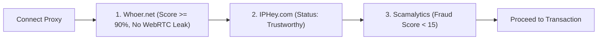

# Proxy Network Isolation & Anti-Ban SOP

Standard operating procedure for deploying clean residential proxy environments, preventing cross-profile correlation, and auditing IP reputation before executing financial transactions.

<HairlineFigure name="plug" />

---

## 1. Operating Directives

- **One Tenant, One IP:** Never multiplex multiple client accounts or project identities across a single proxy.
- **Static Over Rotating for Billing:** Use static residential (ISP) proxies for billing, checkout, and persistent accounts. Use rotating residential exclusively for high-volume data scraping.
- **Pre-Flight Audit Mandatory:** Verify IP fraud score, timezone alignment, and WebRTC leak status before entering credentials or payment data.

---

## 2. Proxy Architecture Classification

| Proxy Category | Infrastructure Origin | Trust Score | Target Operational Use Case | Cost Model |
| :--- | :--- | :---: | :--- | :--- |
| **Static Residential (ISP)** | Real consumer telco networks (AT&T, Verizon, Comcast, Lumen) | **Very High (99%)** | Domain procurement, VCC entry, long-term SaaS session maintenance | Fixed monthly recurring charge per dedicated IP |
| **Rotating Residential** | P2P consumer pool rotated per request or duration | **High (90%)** | Bulk scraping, market research, disposable signups | Metered GB consumption |
| **Datacenter Cloud** | Hosting provider ASN blocks (AWS, DigitalOcean, Hetzner) | **Low (<50%)** | Backend scraping, automated headless testing. **Do not use for checkout.** | Low fixed cost, but flagged by Stripe & Cloudflare |

---

## 3. Verified Proxy Providers

- **[Proxy-Seller](https://proxy-seller.com):**
  - Dedicated static ISP residential IPs categorized by country, state, and city.
  - Unlimited bandwidth on static allocations; primary recommendation for persistent operational profiles.
- **[IPRoyal](https://iproyal.com):**
  - Configurable sticky sessions up to 24 hours on residential pools.
  - Optimal for prolonged account onboarding sessions where mid-flow IP mutation causes fraud flags.
- **[Webshare](https://www.webshare.io):**
  - Cost-efficient static and datacenter pools with fast self-service dashboard API.
  - Best for secondary operations, low-risk telemetry, and proxy aggregation.
- **[Bright Data](https://brightdata.com):**
  - Enterprise-grade global network footprint with highest ASN cleanliness rating.
  - Recommended for critical projects operating under aggressive fraud detection systems.

---

## 4. Pre-Flight Network Audit Protocol

Launch the designated Antidetect profile and execute this 3-step verification sequence before transacting:

1. **Whoer Audit ([whoer.net](https://whoer.net)):**
   - Confirm **Anonymity Score $\ge 90\%$**.
   - Check **WebRTC**: Ensure the public IP displayed matches the proxy address. If the raw office WAN IP appears, terminate the session immediately.
2. **Fingerprint Audit ([iphey.com](https://iphey.com)):**
   - Verify green confirmation banner: *"Your identity is trustworthy"*.
   - Confirm Canvas, WebGL, and AudioContext fingerprints pass without automated emulation warnings.
3. **Fraud Score Audit ([scamalytics.com](https://scamalytics.com)):**
   - Target **Fraud Score $< 15$** (Green zone).
   - If Fraud Score $> 30$ (Amber/Red), discard the proxy immediately and request an IP replacement.

---

## 5. Tactical Execution Rules

### Rule 1: Strict Geo-Matching (IP to Timezone)
- When using a US residential proxy located in California, force the profile timezone to `America/Los_Angeles`.
- Ensure operating system language headers and navigator locales match the target proxy jurisdiction (e.g., `en-US` for US proxies).
- Mismatches between IP geolocation and browser timezone trigger instant checkout rejections.

### Rule 2: Minimum 30-Minute Sticky Sessions
- Never permit IP address changes during payment gateway interaction.
- Sudden mid-checkout IP switching triggers fraud detection algorithms (e.g., Stripe Radar, Adyen), resulting in immediate card lockouts and account termination.
- Configure proxy tunnels for a **minimum 30–60 minute sticky duration**.

---

## 6. Boundaries

- **Never** route financial checkout flows through transparent datacenter proxies or free VPN networks.
- **Never** open client administration panels over raw local office internet connections.
- **Never** proceed with a transaction if the WebRTC leak check reveals the host physical IP address.
