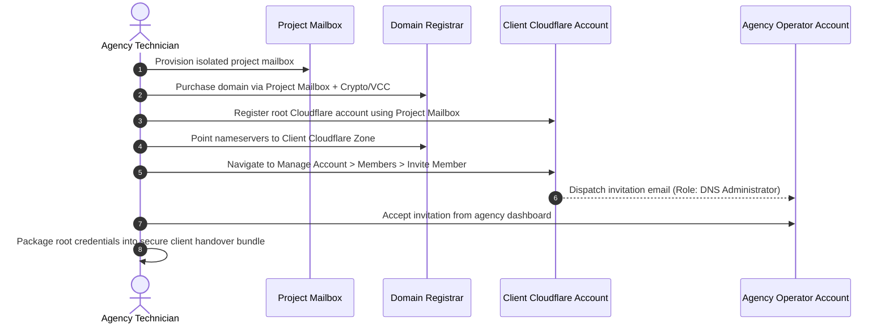

# Domain Procurement & DNS Delegation SOP

Standard operating procedure for purchasing domains with complete WHOIS privacy, executing crypto-funded checkouts, and delegating operational DNS access to agency technicians without transferring legal ownership.

---

## 1. Operating Directives

- **Separation of Ownership:** The client (or project mailbox) remains the sole **Legal Owner** of the domain and root Cloudflare organization. The agency operates strictly as an invited **Technical Operator** (`DNS Administrator`).
- **Zero Identity Exposure:** Never register client domains under agency corporate entities, technician names, or private credit cards.
- **Orange Cloud Mandatory:** Ensure all production web traffic routes through Cloudflare reverse proxy (`Proxied` mode) to completely shield the origin server IP.

---

## 2. Registrar Evaluation Matrix

| Registrar | Portal | WHOIS Privacy | Crypto Support | Evaluation & Recommendation |
| :--- | :--- | :---: | :---: | :--- |
| **Namecheap** | [`namecheap.com`](https://www.namecheap.com) | Free Lifetime | Bitcoin (BTC via BTCPay) | **Standard Recommendation:** Intuitive UI, native BTC deposit support bypassing VCC issuance fees. |
| **Porkbun** | [`porkbun.com`](https://porkbun.com) | Free Default | BTC, ETH, LTC | **Lowest Renewal Rates:** 20%–30% cheaper long-term renewal pricing than competitors. Transparent fee model. |
| **Njalla** | [`njal.la`](https://njal.la) | Absolute Proxy Service | Monero (XMR), BTC | **High-Privacy Operations:** Njalla acts as the legal registrant on paper; accepts zero-KYC Monero payments. |

---

## 3. Technical Delegation Protocol (Cloudflare Zero-Handover)

Manage DNS and routing configurations without possessing root account credentials or passwords:

### Delegation Execution Checklist
1. Log in to the client's root Cloudflare account (created using the project mailbox).
2. Navigate to: **Manage Account $\rightarrow$ Members $\rightarrow$ Invite Members**.
3. Input the agency's centralized operations email address.
4. Set role strictly to: **DNS Administrator** (or restrict to single-zone edit permissions).
5. Open the agency inbox and accept the invitation.
6. The agency can now configure DNS records, WAF rules, and page rules while the client retains absolute sovereign ownership.

---

## 4. Tactical Operational Rules

### Rule 1: Post-Purchase WHOIS Privacy Verification
Immediately following purchase, query the public WHOIS registry using `whois <domain>` or [whois.domaintools.com](https://whois.domaintools.com):
- Confirm registrant name shows a privacy proxy (e.g., *Withheld for Privacy*, *PrivacyGuardian*).
- Confirm personal names, phone numbers, and physical office addresses are 100% absent.

### Rule 2: Cloudflare Proxy Ingress Enforcement
- In the Cloudflare DNS dashboard, verify the status icon on all `A`, `AAAA`, and `CNAME` records resolves to **Orange Cloud (Proxied)**.
- Bypassing the proxy (`DNS Only / Grey Cloud`) leaks the origin IP directly to automated network scanners (Censys, Shodan).

### Rule 3: Mandatory ICANN Email Verification (24-Hour SLA)
- ICANN mandates contact verification within 15 days of new domain registration.
- Registrars dispatch a verification link to the project mailbox upon checkout.
- **Mandatory Action:** Open the project mailbox and click **Verify Contact Information** within the first 24 hours. Failure to click triggers automatic domain suspension by the registrar.

---

## 5. Boundaries

- **Never** register a client domain under the agency's primary registrar account.
- **Never** request root owner credentials when DNS Administrator delegation is supported.
- **Never** point domain nameservers directly to an unprotected origin server IP without an edge security layer.
