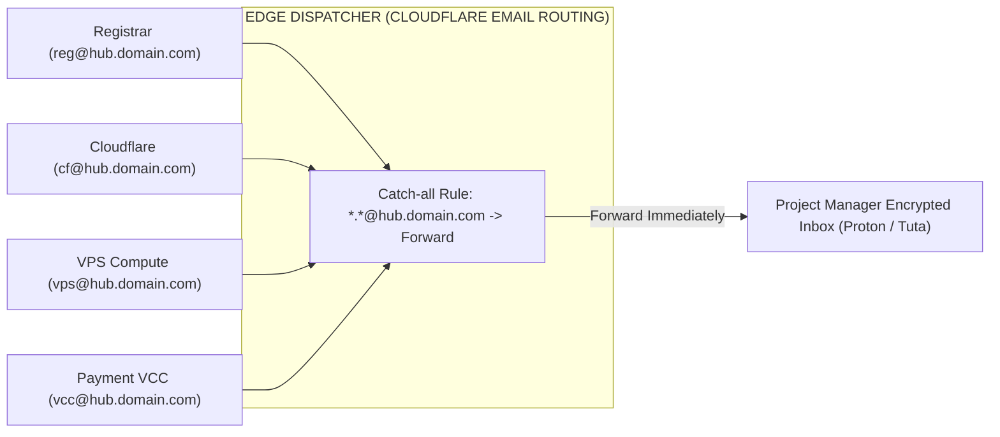

# Anonymous Email & Credential Hygiene SOP

Standard operating procedure for provisioning SMS-free project mailboxes, implementing catch-all alias routing, and maintaining zero-leak credential vaults for rapid client handover.

---

## 1. Operating Directives

- **Zero Personal SIM Binding:** Never tie project mailboxes to employee mobile numbers. Use E2EE privacy providers or custom catch-all forwarders that require zero phone verification.
- **Unique Email Per Service:** Isolate vendor registrations (`domain@...`, `vps@...`, `vcc@...`). Database leaks at one vendor must never reveal sibling infrastructure accounts.
- **Encrypted Vault Storage:** Store every credential, 2FA secret, and backup key inside KeePassXC or Bitwarden vaults. Unencrypted plaintext storage in spreadsheets or chat apps is strictly forbidden.

---

## 2. Mailbox Provider Evaluation Matrix

| Provider | Portal | Cryptographic Standard | Phone Requirement | Core Capability |
| :--- | :--- | :--- | :---: | :--- |
| **Proton Mail** | [`proton.me/mail`](https://proton.me/mail) | End-to-End Encryption (Switzerland) | **Optional** (Clean ISP IP) | Enterprise UI, mobile app support, established global trust score. |
| **Tuta Mail** | [`tuta.com`](https://tuta.com) | Post-Quantum E2EE (Germany) | **None** | Full metadata encryption, zero IP logging, instantaneous registration. |
| **SimpleLogin** | [`simplelogin.io`](https://simplelogin.io) | PGP-Encrypted Aliases (Proton ecosystem) | **None** | Generates unlimited disposable forwarders routed to a single inbox. |
| **Addy.io** | [`addy.io`](https://addy.io) | Open-Source Alias Routing | **None** | Supports custom domain attachments for unlimited branded aliases. |
| **Cloudflare Email Routing** | [`dash.cloudflare.com`](https://dash.cloudflare.com) | Edge DNS Forwarding | **None** | **100% Free:** Instant catch-all forwarding configured directly on your managed domain. |

---

## 3. Catch-All Architecture (Centralized Ingress)

Consolidate operational notifications and OTP tokens into a single master inbox without registering individual mailboxes per vendor:

### Ingress Benefits
- **Zero Account Creation Latency:** Generate arbitrary addresses on the fly during registration (`vps-01@hub.domain.com`) without logging into an email dashboard.
- **Unified OTP Funnel:** All verification links and 2FA tokens flow directly into the operator's primary encrypted vault.

---

## 4. Tactical Operational Rules

### Rule 1: Bypassing SMS Checks on Proton / Tuta
When registering new privacy mailboxes, automated detection triggers phone verification if the connection originates from flagged cloud IPs.
1. Connect via an Antidetect profile bound to a **Clean Static Residential (ISP) Proxy**.
2. Clear cookies and verify the connection passes [whoer.net](https://whoer.net) with zero WebRTC leaks.
3. Initiate registration: The system will present an image CAPTCHA or optional secondary email prompt instead of an SMS requirement.

### Rule 2: Offline Vault Management Protocol (KeePassXC / Bitwarden)
1. **Entropy:** Generate minimum 24-character alphanumeric passwords with special characters.
2. **2FA Archival:** Copy the raw base32 TOTP secret key or snapshot the QR code directly into the vault record.
3. **Emergency Recovery Keys:** When enabling 2FA, immediately save all 8–10 single-use emergency backup codes into the secure note field.
4. **Client Handover:** Export strictly the filtered records belonging to the specific project. Purge the project database from local systems upon delivery receipt.

---

## 5. Boundaries

- **Never** register operational infrastructure with consumer email accounts (Gmail, Yahoo) tied to personal identity.
- **Never** communicate production passwords or 2FA backup codes over unencrypted messaging channels (Telegram, Slack, WhatsApp).
- **Never** delete a project mailbox before transferring root domain and hosting asset ownership to the client.
