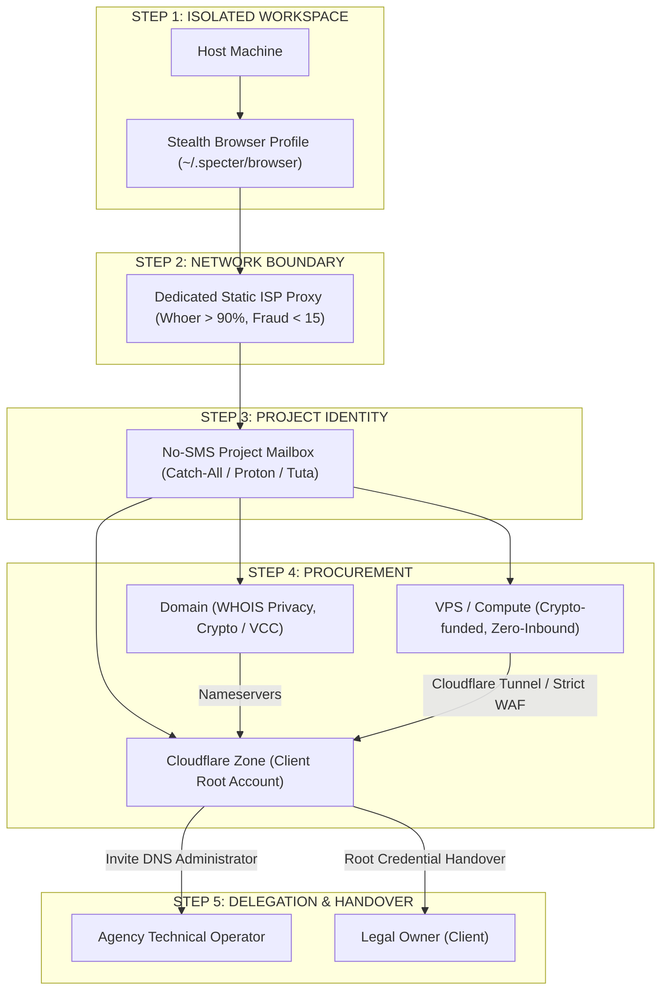

# Operational Runbook: Digital Asset Procurement & Account Isolation

Standard operating procedure for provisioning domains, servers, payment cards, proxies, and mailboxes with strict legal boundary separation, project-level budget control, and zero personal identity leakage.

---

## 1. Core Operating Mandates

1. **Zero Personal Identity Leakage:** Never use personal payment cards, phone numbers, or residential IP addresses for client or project infrastructure. Technicians operate strictly as authorized delegates (`Technical Operator`), never legal owners.
2. **Deterministic Budget Isolation:** Bind every project to an isolated burnable card or direct crypto balance. Freeze cards immediately upon procurement to prevent silent recurring charges.
3. **Blast Radius Containment:** Enforce 1:1 binding between browser profiles, residential proxies, and project mailboxes. An audit or flag on one tenant must never cascade across the fleet.

---

## 2. Standard 5-Step Operational Pipeline

---

## 3. Operational Runbook Directory

| Index | Module | Reference Document | Core Mandate |
| :---: | :--- | :--- | :--- |
| **01** | **Virtual Cards & Billing** | [`01-vcc-payment-guide.md`](./01-vcc-payment-guide.md) | Crypto-funded VCCs, BIN debit verification, balance buffers ($2–$3), freeze-on-complete SOP. |
| **02** | **Proxy Network Isolation** | [`02-proxy-network-isolation.md`](./02-proxy-network-isolation.md) | Static residential ISP proxies, geo-timezone matching, WebRTC leak auditing, anti-ban checklist. |
| **03** | **Domain & DNS Delegation** | [`03-domain-dns-delegation.md`](./03-domain-dns-delegation.md) | WHOIS shielding, crypto registrars, Cloudflare role-based delegation (`DNS Administrator`). |
| **04** | **Hosting & VPS Infrastructure** | [`04-hosting-vps-infrastructure.md`](./04-hosting-vps-infrastructure.md) | Crypto VPS providers, origin IP masking, SSH key enforcement, Cloudflare Tunnel ingress. |
| **05** | **Anonymous Email & Identity** | [`05-anonymous-email-identity.md`](./05-anonymous-email-identity.md) | SMS-free mailboxes, catch-all routing, KeePassXC / Bitwarden encrypted vault hygiene. |
| **06** | **Technical Glossary** | [`06-glossary-terminology.md`](./06-glossary-terminology.md) | High-density reference for VCC, BIN, 3DS, WebRTC, Origin IP, E2EE, and blast containment. |

---

## 4. Pre-Handover Verification Checklist

Run this gate check before releasing infrastructure or handing credentials to a client:

- [ ] **M1 — Network Hygiene:** Dedicated static residential proxy attached; Whoer anonymity score $\ge 90\%$; Scamalytics fraud score $< 15$; zero WebRTC leaks.
- [ ] **M2 — Mailbox Isolation:** Project-dedicated mailbox configured; 2FA active; emergency recovery codes backed up in KeePassXC/Bitwarden vault.
- [ ] **M3 — Domain Compliance:** Registered with WHOIS Privacy enabled; ICANN email verification completed within 24 hours.
- [ ] **M4 — Billing Guardrails:** Card funded with order total $+ \$2$ buffer; card frozen or closed immediately post-purchase.
- [ ] **M5 — Server Hardening:** Public SSH password login disabled (`PasswordAuthentication no`); origin IP proxied behind Cloudflare WAF; port 22 bound to Cloudflare Tunnel.
- [ ] **M6 — Delegation Integrity:** Client holds root registrar and Cloudflare credentials; agency holds scoped `DNS Administrator` role only.
- [ ] **M7 — Workspace Cleanup:** Credentials exported to client handover bundle; local temporary browser profiles pruned from host machine.

---

## 5. Boundaries

- **Never** register client assets under agency personal identities, phone numbers, or corporate credit cards.
- **Never** route multi-tenant operational traffic through shared datacenter proxies or raw office WAN.
- **Never** keep public management ports (SSH 22, RDP 3389) open to the internet without a zero-trust tunnel.
